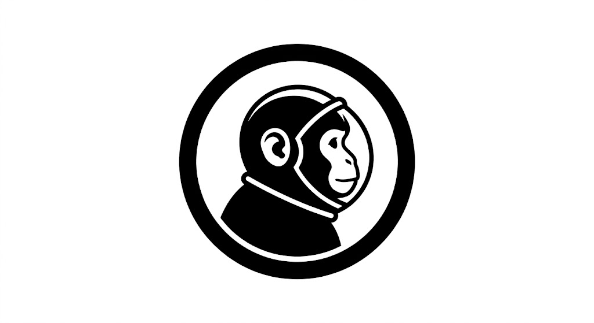

# Albert

[English README](./README.md)

<p align="center">
  
</p>

Albert 是一个 AI 驱动的 API Mock 桌面客户端，面向前端和客户端开发者。它的目标是把接口描述快速转成可用的 Mock 响应，减少传统 Mock 工具里繁琐的字段配置和假数据编排工作。

## 命名由来

很多 Mock 工具喜欢借用 `Monkey` 这个词，表达“替身、模拟、玩具化测试”的意味。Albert 选择了另一条路。

- `Albert` 的命名来自 Albert II，也就是人类历史上第一只进入太空的猴子。
- 这个命名保留了 `Mock` 与 `Monkey` 之间的语义联想，但避免把产品做成一个泛化的“猴子工具”。
- 当前主视觉标识就是这枚“太空猴子”徽章，源文件放在 `assets/branding/` 下。

## 一期范围

一期目标刻意收敛，当前仓库主要用于建立后续开发的基础：

- 完整的中英文文档体系
- 工作区与模块边界骨架
- `Tauri + React + TypeScript` 桌面壳
- `canonical schema / parser / storage / gateway / openai provider` 的 Rust crate 占位
- 对未实现能力使用显式 `not implemented` 方式标记扩展点

一期暂不包含：

- 可用于生产的 OpenAPI / cURL 解析实现
- 真正可对外监听的本地 Mock HTTP 网关
- SQLite 持久化接线
- 请求指纹缓存和分层回源策略
- AI 实时生成链路

## 架构快照

- `apps/desktop`：Tauri 桌面壳与 React 控制台
- `crates/albert-core`：标准化领域模型与共享契约
- `crates/albert-parser`：OpenAPI / cURL 解析入口
- `crates/albert-storage`：SQLite 仓储与迁移边界
- `crates/albert-gateway`：本地 Mock 网关边界
- `crates/albert-openai`：OpenAI Chat Completions 适配层
- `docs/`：PRD、架构、路线图、开放问题
- `llmdoc/`：后续持续维护的项目知识体系

## 核心文档

- [PRD](./docs/prd.md)
- [架构文档](./docs/architecture.md)
- [实施路线图](./docs/roadmap.md)
- [开放问题清单](./docs/open-questions.md)

## 品牌资产

- 导出主位图：[assets/branding/albert-logo-reference.png](./assets/branding/albert-logo-reference.png)
- 矢量参考图：[assets/branding/albert-logo.svg](./assets/branding/albert-logo.svg)
- 导出的 PNG 资源目录：[assets/branding](./assets/branding)
- 桌面端图标目录：[apps/desktop/src-tauri/icons](./apps/desktop/src-tauri/icons)
- Web favicon 目录：[apps/desktop/public](./apps/desktop/public)
- 全量重新导出图标：`./scripts/generate_brand_assets.sh`

## 目录结构

```text
.
|-- .github/
|   `-- workflows/
|-- assets/
|   `-- branding/
|-- apps/
|   `-- desktop/
|       |-- src/
|       `-- src-tauri/
|-- crates/
|   |-- albert-core/
|   |-- albert-gateway/
|   |-- albert-openai/
|   |-- albert-parser/
|   `-- albert-storage/
|-- docs/
|-- fixtures/
|-- scripts/
`-- llmdoc/
```

## 快速开始

当前骨架刻意保持轻量，部分模块仍为占位实现。

```bash
npm install
npm run dev
```

安装依赖后，如需启动桌面壳：

```bash
npm --workspace apps/desktop run tauri:dev
```

## 当前状态

- React UI 骨架：已具备，但当前只是用于验证 Phase 2 链路的占位工作台
- Tauri 壳：已接通 bootstrap、parse、import、list 等基础命令
- 标准化 schema：已定义，并由 parser 单测覆盖核心路径
- parser / storage crate：已进入部分实现阶段，支持 SQLite 落库与回查
- CI：GitHub Actions 已覆盖 Rust 格式、单测、workspace 检查、前端构建和品牌资源漂移校验
- 当前桌面 UI 不视为最终产品形态，只作为后续工具界面的临时承载层
